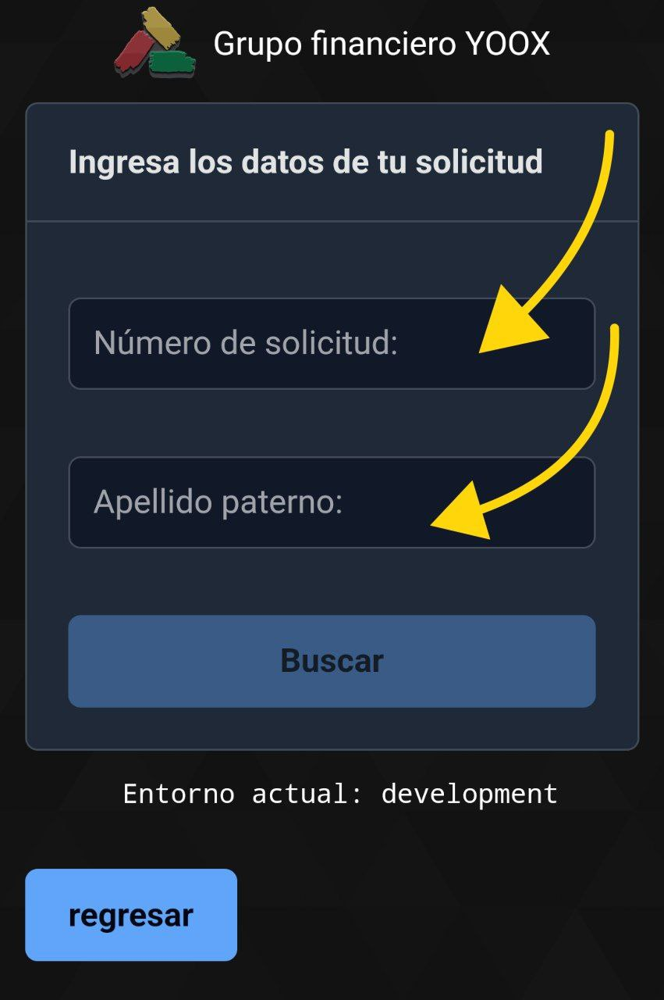
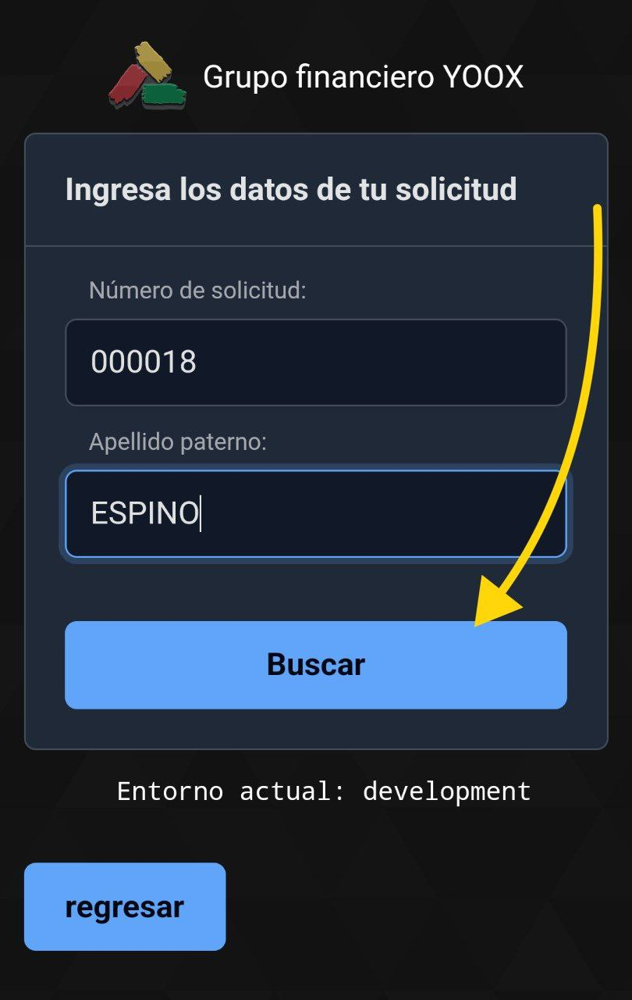
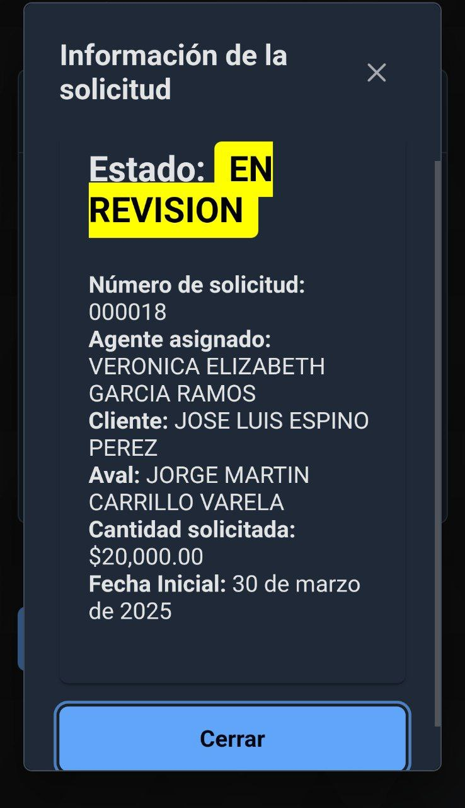
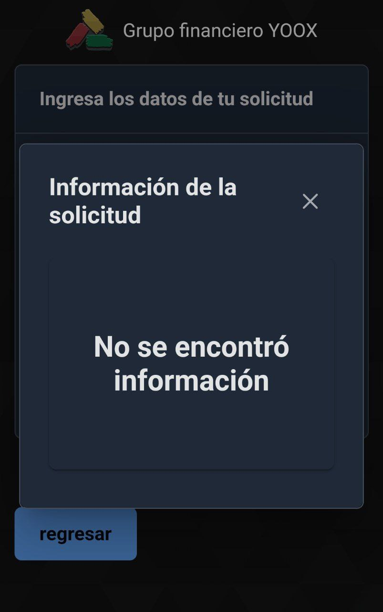

# Guía rápida - Consulta de estatus de solicitud

## Introducción

El módulo de consulta de status permite tanto a clientes como a empleados verificar el estado actual de una solicitud de préstamo en el sistema. Esta sección del manual explica cómo utilizar esta funcionalidad para obtener información actualizada sobre el avance de las solicitudes.

## Tipos de usuarios

El sistema permite dos tipos de consultas dependiendo del usuario:

1. **Consulta para empleados (usuarios de sistema)**: Acceso completo a toda la información y estados de las solicitudes.
2. **Consulta para clientes (usuarios externos)**: Acceso limitado a la información básica de sus propias solicitudes.

<h3>Recomendación</h3>
<ol>
<li>Los agentes también pueden consultar siempre el estatus de la solicitud por medio de la consulta para usuarios externos</li>
</ol>

---

# Información de solicitud de préstamo

Una vez localizada la información, los clientes podrán visualizar:

| Información | Descripción |
|-------------|-------------|
| Número de solicitud | Número único de identificación de la solicitud |
| Agente asignado | Agente qué realizó la negociación de la solicitud |
| Cliente | Nombre de la persona que solicita el préstamo |
| Aval | Nombre de la persona que respaldará al cliente |
| Cantidad solicitada | Cantidad en moneda nacional solicitada por el cliente |
| Fecha inicial | Fecha en que se hará efectivo el préstamo |

---

# Estatus de la solicitud

Los estatus de una solicitud son:

- **EN REVISIÓN**: La solicitud está en proceso de validación
- **ACTUALIZAR**: Se requieren documentos o datos adicionales
- **APROBADA**: La solicitud ha sido aceptada
- **RECHAZADA**: La solicitud no fue aprobada

---

# Consulta para clientes (usuarios externos)

Los clientes pueden consultar el status de su solicitud a través del portal web siguiendo estos pasos:

Ingresar a la página principal de YooX Financiera:
---
Hacer clic en el botón "Consulta tu solicitud"

---
Ingresar el número de solicitud y el apellido paterno en los campos correspondientes:

---
Dar clic en "Buscar":

---
Si la información proporcionada es correcta, se mostrará la información del estatus actual de la solicitud:

---
Si alguno de los datos es incorrecto, se mostrará un mensaje de error:

<h3>Recomendación</h3>
<ol>
<li>En caso de error, verifique que la información proporcionada es correcta</li>
<li>Si el error persiste, consulte con el administrador del sistema</li>
</ol>

---
# Consulta para empleados (usuarios de sistema)

### Acceso al módulo de consulta

Para acceder al módulo de consulta como empleado:

1. Iniciar sesión en la plataforma con sus credenciales
2. En el menú principal, hacer clic en "Solicitudes"
3. Seleccionar "Consultar solicitudes"

### Búsqueda de solicitudes

Los empleados pueden buscar solicitudes utilizando diferentes criterios:

- **Búsqueda por folio**: Ingresar el número de folio exacto
- **Búsqueda por cliente**: Ingresar nombre, CURP o teléfono
- **Búsqueda por fecha**: Seleccionar un rango de fechas
- **Búsqueda por estado**: Filtrar por el status actual
- **Búsqueda avanzada**: Combinar varios criterios

### Vista detallada de solicitud

Al seleccionar una solicitud específica, el empleado puede ver:

1. **Información general**:
   - Datos del cliente
   - Detalles del préstamo
   - Historial de pagos (si aplica)
   - Documentación recibida

2. **Historial de cambios de estado**:
   - Fecha y hora de cada cambio
   - Usuario que realizó el cambio
   - Comentarios asociados a cada cambio

3. **Sección de comunicaciones**:
   - Registro de llamadas realizadas
   - Mensajes enviados
   - Notas internas

### Gestión de estados

Los empleados autorizados pueden cambiar el estado de una solicitud:

1. En la vista detallada, hacer clic en "Cambiar estado"
2. Seleccionar el nuevo estado en el menú desplegable
3. Ingresar un comentario explicando el motivo del cambio
4. Hacer clic en "Guardar cambios"

> **Importante**: Cada cambio de estado queda registrado en el historial con fecha, hora y usuario que lo realizó.

### Estados disponibles para empleados

Los estados que puede gestionar un empleado son:

- **Pendiente de revisión**: Estado inicial al crear la solicitud
- **En análisis**: La solicitud está siendo evaluada
- **Documentación incompleta**: Se necesitan más documentos
- **En verificación**: Se están confirmando datos o referencias
- **Aprobada**: La solicitud cumple con los requisitos
- **En proceso de desembolso**: Trámite para entrega del préstamo
- **Desembolsada/Activa**: El préstamo fue entregado
- **Rechazada**: No cumple con los requisitos
- **Cancelada**: El cliente decidió no continuar
- **Liquidada**: El préstamo fue pagado totalmente

### Exportación de información

Los empleados pueden exportar la información de las solicitudes en diferentes formatos:

1. En la vista de resultados de búsqueda, hacer clic en "Exportar"
2. Seleccionar el formato deseado (Excel, PDF, CSV)
3. Elegir la información a incluir en el reporte
4. Hacer clic en "Generar reporte"

## Panel de control y estadísticas

El sistema proporciona un panel de control con estadísticas sobre las solicitudes:

- **Resumen diario**: Solicitudes nuevas, aprobadas y rechazadas
- **Tiempo promedio de respuesta**: Desde la creación hasta la aprobación
- **Distribución por estado**: Gráfico con la cantidad de solicitudes en cada estado
- **Tendencias**: Comparativa con períodos anteriores

## Preguntas frecuentes

**P: ¿Cómo puede un cliente recuperar su número de folio si lo ha perdido?**  
R: El cliente puede comunicarse al centro de atención telefónica proporcionando su CURP y datos personales para verificar su identidad.

**P: ¿Se notifica automáticamente al cliente cuando cambia el estado de su solicitud?**  
R: Sí, el sistema envía notificaciones por SMS y/o correo electrónico (si se proporcionó) cuando hay cambios significativos.

**P: ¿Pueden los empleados ver solicitudes de todas las sucursales?**  
R: Depende del nivel de acceso asignado. Los administradores pueden ver todas las solicitudes, mientras que otros usuarios solo pueden ver las de su sucursal.

**P: ¿Es posible reactivar una solicitud rechazada?**  
R: No directamente. Se debe crear una nueva solicitud, pero es posible referenciar el folio anterior en los comentarios.

## Consejos útiles

- Actualizar el estado de las solicitudes oportunamente para mantener informados a los clientes
- Agregar comentarios detallados al cambiar el estado para facilitar el seguimiento
- Utilizar los filtros de búsqueda para localizar rápidamente solicitudes específicas
- Revisar el panel de control diariamente para identificar cuellos de botella en el proceso
- Verificar que los datos de contacto del cliente estén actualizados para garantizar la correcta recepción de notificaciones
